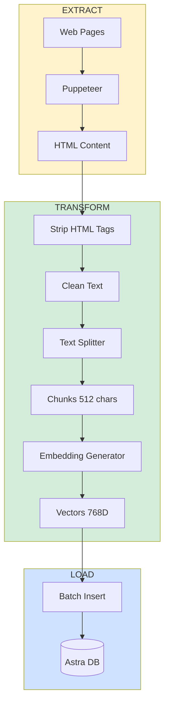

# 🏗️ Arquitetura do Chatbot F1 - Documentação Técnica

## Visão Geral da Arquitetura

Este documento detalha a arquitetura completa do chatbot F1, incluindo diagramas visuais, decisões técnicas e fluxo de dados.

---

## 📊 Diagrama Visual da Arquitetura


---

## 🎯 Padrões de Arquitetura Utilizados

### 1. RAG (Retrieval-Augmented Generation)

**O que é?**

- Padrão arquitetural que combina busca de informações (retrieval) com geração de texto (generation)
- Permite que LLMs respondam com base em conhecimento externo atualizado

**Componentes:**

```
┌─────────────────────────────────────────────────┐
│           RAG Architecture Pattern               │
├─────────────────────────────────────────────────┤
│                                                  │
│  1. INDEXING (Offline)                          │
│     Documents → Chunks → Embeddings → Vector DB │
│                                                  │
│  2. RETRIEVAL (Online)                          │
│     Query → Embedding → Vector Search → Top-K   │
│                                                  │
│  3. GENERATION (Online)                         │
│     Context + Query → LLM → Response            │
│                                                  │
└─────────────────────────────────────────────────┘
```

**Vantagens:**

- ✅ Respostas baseadas em fatos (não alucinações)
- ✅ Conhecimento atualizável sem retreinar modelo
- ✅ Rastreabilidade (podemos saber de onde veio a info)
- ✅ Custo menor que fine-tuning

**Desvantagens:**

- ⚠️ Latência adicional (2 chamadas à API)
- ⚠️ Complexidade de infraestrutura (banco vetorial)
- ⚠️ Dependência da qualidade dos chunks

### 2. Server-Side Rendering + Client Components (Next.js)

```
┌─────────────────────────────────────────────────┐
│          Next.js Hybrid Architecture             │
├─────────────────────────────────────────────────┤
│                                                  │
│  SERVER COMPONENTS (page.tsx, layout.tsx)       │
│    - Renderizam no servidor                     │
│    - Zero JavaScript enviado ao cliente         │
│    - Acesso direto a banco de dados             │
│                                                  │
│  CLIENT COMPONENTS ("use client")               │
│    - Chat.tsx, LoadingBubble.tsx                │
│    - Interatividade (useState, onClick)         │
│    - JavaScript enviado ao navegador            │
│                                                  │
│  API ROUTES (/api/chat/route.ts)                │
│    - Backend integrado ao frontend              │
│    - Serverless functions                       │
│                                                  │
└─────────────────────────────────────────────────┘
```

### 3. ETL Pipeline (Extract, Transform, Load)



---

## 🔄 Fluxo de Dados Detalhado

### Fluxo 1: Indexação (Executado uma vez)

```
┌──────────────┐
│ loadDb.ts    │ Script executado com npm run seed
└──────┬───────┘
       │
       ├─► 1. Puppeteer navega para URL
       │      - Carrega página completa
       │      - Aguarda JavaScript executar
       │      - Extrai HTML do body
       │
       ├─► 2. Limpeza de conteúdo
       │      - Remove tags HTML (<p>, <div>, etc)
       │      - Remove caracteres especiais
       │      - Mantém apenas texto puro
       │
       ├─► 3. Divisão em chunks
       │      - RecursiveCharacterTextSplitter
       │      - Tamanho: 512 caracteres
       │      - Sobreposição: 200 caracteres
       │      - Preserva parágrafos quando possível
       │
       ├─► 4. Geração de embeddings
       │      - Para cada chunk:
       │        • Chama Gemini text-embedding-004
       │        • Recebe vetor de 768 números
       │        • Vetor representa significado semântico
       │
       └─► 5. Armazenamento
            - Insere no Astra DB:
              • Campo $vector: [0.123, -0.456, ...]
              • Campo text: "conteúdo do chunk"
              • Indexed para busca vetorial
```

### Fluxo 2: Consulta em Tempo Real

```
┌──────────────┐
│ Usuário      │ "Quem venceu o campeonato 2024?"
└──────┬───────┘
       │
       ├─► FRONTEND (Chat.tsx)
       │   └─► handleSubmit()
       │       - Adiciona mensagem ao estado
       │       - Mostra loading bubble
       │       - POST /api/chat
       │
       ├─► BACKEND (route.ts)
       │   │
       │   ├─► Etapa 1: Extração da pergunta
       │   │   - Pega última mensagem do array
       │   │   - latestMessage = "Quem venceu..."
       │   │
       │   ├─► Etapa 2: Embedding da pergunta
       │   │   - Gemini embedContent(latestMessage)
       │   │   - Retorna: vector[768] = [0.234, -0.567, ...]
       │   │
       │   ├─► Etapa 3: Busca vetorial
       │   │   - collection.find({}, { sort: { $vector: vector }, limit: 10 })
       │   │   - Astra DB calcula similaridade (dot product)
       │   │   - Retorna 10 chunks mais similares
       │   │   - Exemplo:
       │   │       Chunk 1: "Max Verstappen venceu..."
       │   │       Chunk 2: "Red Bull Racing..."
       │   │       ...
       │   │
       │   ├─► Etapa 4: Construção do prompt
       │   │   - SYSTEM: "Você é assistente F1..."
       │   │   - CONTEXT: JSON com os 10 chunks
       │   │   - USER: "Quem venceu..."
       │   │
       │   ├─► Etapa 5: Geração da resposta
       │   │   - generateText(model: gemini-2.5-flash)
       │   │   - LLM analisa context + pergunta
       │   │   - Gera resposta natural
       │   │
       │   └─► Etapa 6: Retorno
       │       - JSON: { content: "Max Verstappen venceu..." }
       │
       └─► FRONTEND (Chat.tsx)
           - Recebe resposta
           - Adiciona ao estado messages[]
           - Remove loading bubble
           - Renderiza resposta na tela
```

---

## 🧩 Componentes da Arquitetura

### 1. Camada de Apresentação (Frontend)

```typescript
// Estrutura de componentes React
app/
├── page.tsx                    // Server Component (SEO, estático)
│   └── <Chat />                // Client Component (interativo)
       │
       ├── <PromptSuggestionsRow />   // Sugestões de perguntas
       │   └── onClick → handlePromptClick()
       │
       ├── <LoadingBubble />          // Animação de loading
       │   └── CSS animations (3 bolinhas)
       │
       └── <form>                     // Formulário de envio
           └── onSubmit → handleSubmit()
```

**Responsabilidades:**

- ✅ Gerenciar estado de mensagens (`useState`)
- ✅ Capturar input do usuário
- ✅ Fazer chamadas HTTP para `/api/chat`
- ✅ Renderizar histórico de conversas
- ✅ Exibir loading states

### 2. Camada de API (Backend)

```typescript
// API Route Handler
app / api / chat / route.ts;

export async function POST(req: Request) {
  // 1. Parse do request
  const { messages } = await req.json();

  // 2. Geração de embedding
  const embedding = await embedContent(latestMessage);

  // 3. Busca vetorial
  const docs = await collection.find({
    sort: { $vector: embedding },
  });

  // 4. Geração de resposta
  const result = await generateText({
    model: gemini,
    system: template + context,
    messages,
  });

  // 5. Retorno
  return Response.json({ content: result.text });
}
```

**Responsabilidades:**

- ✅ Validar requests
- ✅ Orquestrar chamadas à IA e banco de dados
- ✅ Tratamento de erros
- ✅ Formatação de respostas

### 3. Camada de Dados

```
┌─────────────────────────────────────────┐
│         Astra DB (Cassandra)            │
├─────────────────────────────────────────┤
│                                         │
│  Collection: f1_embeddings              │
│  ┌────────────────────────────────┐    │
│  │ Document Structure:            │    │
│  │ {                              │    │
│  │   _id: "uuid-auto-generated",  │    │
│  │   $vector: [0.12, -0.34, ...], │    │
│  │   text: "chunk content..."     │    │
│  │ }                              │    │
│  └────────────────────────────────┘    │
│                                         │
│  Índice Vetorial:                      │
│  - Algoritmo: ANN (Approximate NN)     │
│  - Métrica: dot_product                │
│  - Dimensões: 768                      │
│                                         │
└─────────────────────────────────────────┘
```

**Por que Astra DB?**

- ✅ **Vetorial nativo**: Suporta busca por similaridade out-of-the-box
- ✅ **Serverless**: Não precisa gerenciar infraestrutura
- ✅ **Escalável**: Baseado em Cassandra (milhões de operações/seg)
- ✅ **Global**: Deploy multi-região
- ✅ **Free tier**: 25GB grátis (suficiente para projetos pequenos)

### 4. Camada de IA

```
┌──────────────────────────────────────────────┐
│          Google Gemini APIs                   │
├──────────────────────────────────────────────┤
│                                               │
│  1. text-embedding-004                       │
│     Input:  "Texto qualquer..."              │
│     Output: [768 números float]              │
│     Uso:    Converter texto em vetor         │
│                                               │
│  2. gemini-2.5-flash                         │
│     Input:  System + Context + Messages      │
│     Output: Texto gerado                     │
│     Uso:    Gerar respostas do chatbot       │
│                                               │
└──────────────────────────────────────────────┘
```

**Modelos escolhidos:**

| Modelo                 | Uso        | Por quê?                                                                                        |
| ---------------------- | ---------- | ----------------------------------------------------------------------------------------------- |
| **text-embedding-004** | Embeddings | ✅ 768 dimensões (ótimo custo-benefício)<br>✅ Multilíngue<br>✅ Velocidade alta<br>✅ Gratuito |
| **gemini-2.5-flash**   | Geração    | ✅ Rápido (latência < 1s)<br>✅ Custo baixo<br>✅ Contexto de 1M tokens<br>✅ Qualidade alta    |

---

## 📐 Decisões Arquiteturais

### Por que Next.js?

✅ **Server Components** → Menos JavaScript no cliente (mais rápido)  
✅ **API Routes** → Backend integrado (sem servidor separado)  
✅ **File-based routing** → Organização clara  
✅ **Vercel Deploy** → Deploy com 1 comando

### Por que Vercel AI SDK ao invés de SDK direto do Gemini?

✅ **Abstração** → Mesma interface para OpenAI, Anthropic, Gemini  
✅ **Streaming** → Suporte nativo para respostas em tempo real  
✅ **React Hooks** → `useChat` simplifica gerenciamento de estado  
✅ **Type-safe** → TypeScript first-class

### Por que LangChain para scraping?

✅ **Loaders prontos** → PuppeteerWebBaseLoader já implementado  
✅ **Text Splitter inteligente** → Mantém contexto entre chunks  
✅ **Ecossistema** → Fácil adicionar novos loaders (PDF, YouTube, etc)

**Alternativas consideradas:**

- ❌ Cheerio → Não funciona com JavaScript-rendered pages
- ❌ Playwright → Similar ao Puppeteer, mas menos adotado
- ⚠️ Puppeteer puro → Funciona, mas precisa implementar lógica de chunking

### Por que 512 caracteres de chunk?

**Análise:**

- Muito pequeno (< 200) → Perde contexto, muitas chamadas à API
- Muito grande (> 1000) → Contexto irrelevante, menos precisão na busca

**Escolha: 512 caracteres**

- ✅ ~1-2 parágrafos (contexto suficiente)
- ✅ ~100-150 tokens (abaixo do limite ideal para embeddings)
- ✅ Sobreposição de 200 chars mantém continuidade

---

## 🔒 Segurança

### Variáveis de Ambiente

```bash
# ❌ NUNCA faça isso:
const apiKey = "AIzaSyXXXXXXXXXXXX"

# ✅ Sempre use .env:
GOOGLE_AI_GENERATE=AIzaSyXXXXXXXXXXXX
```

**.gitignore** protege credenciais:

```gitignore
.env
.env.local
.env.production
```

### Validação de Input

```typescript
// Sempre valide input do usuário
if (!input?.trim()) {
  return; // Não envia mensagens vazias
}

// Considere adicionar limitação de tamanho
if (input.length > 1000) {
  alert("Mensagem muito longa!");
  return;
}
```

### Rate Limiting

**Recomendação para produção:**

```typescript
// Middleware de rate limit (não implementado neste projeto)
import { ratelimit } from "@upstash/ratelimit";

const limiter = ratelimit({
  redis: Redis.fromEnv(),
  limiter: Ratelimit.slidingWindow(10, "1 m"), // 10 requests/minuto
});
```

---

## 📈 Performance e Otimizações

### 1. Latência da API

**Atual:**

```
Usuário envia → Embedding (500ms) → DB Search (200ms) → Generation (1-2s) → Resposta
Total: ~2-3 segundos
```

**Otimizações possíveis:**

- ✅ Cache de embeddings de perguntas comuns (Redis)
- ✅ Streaming de respostas (`streamText` do AI SDK)
- ✅ Prefetch de chunks populares

### 2. Tamanho do Bundle

**Problema:** LangChain é pesado (~2MB)

**Solução:**

```typescript
// ❌ Import completo
import { RecursiveCharacterTextSplitter } from "langchain";

// ✅ Import específico (tree-shaking)
import { RecursiveCharacterTextSplitter } from "@langchain/textsplitters";
```

### 3. Server Components

```typescript
// ✅ Renderiza no servidor (0 KB JavaScript)
export default function Page() {
    return <Chat /> // Client Component
}

// ✅ Apenas Chat.tsx vai para o navegador
```

---

## 🧪 Testing (Recomendado para produção)

```typescript
// Exemplo de teste unitário (não implementado)
describe("Chat API", () => {
  it("should return valid response", async () => {
    const response = await POST({
      json: () => ({ messages: [{ role: "user", content: "test" }] }),
    });

    expect(response.status).toBe(200);
    const data = await response.json();
    expect(data.content).toBeDefined();
  });
});
```

---

## 📊 Monitoramento (Sugestões)

Para produção, considere adicionar:

- **Logs estruturados**: Winston, Pino
- **APM**: Sentry, Datadog
- **Métricas**:
  - Latência média das respostas
  - Taxa de erro da API
  - Uso de tokens do Gemini
  - Tamanho médio do contexto recuperado

---

## 🚀 Deploy

### Vercel (Recomendado)

```bash
# Instale CLI da Vercel
npm i -g vercel

# Configure variáveis de ambiente no dashboard
# https://vercel.com/dashboard → Settings → Environment Variables

# Deploy
vercel --prod
```

### Docker (Alternativa)

```dockerfile
FROM node:20-alpine
WORKDIR /app
COPY package*.json ./
RUN npm install
COPY . .
RUN npm run build
EXPOSE 3000
CMD ["npm", "start"]
```

---

## 📚 Referências e Recursos

- [Next.js Documentation](https://nextjs.org/docs)
- [Vercel AI SDK](https://sdk.vercel.ai/docs)
- [Google Gemini API](https://ai.google.dev/docs)
- [Astra DB Docs](https://docs.datastax.com/en/astra/home/astra.html)
- [LangChain Documentation](https://js.langchain.com/docs/)
- [RAG Best Practices](https://www.pinecone.io/learn/retrieval-augmented-generation/)

---

**Última atualização**: 2025-12-11
