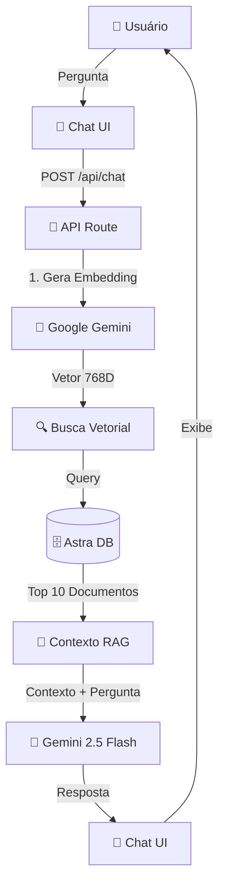
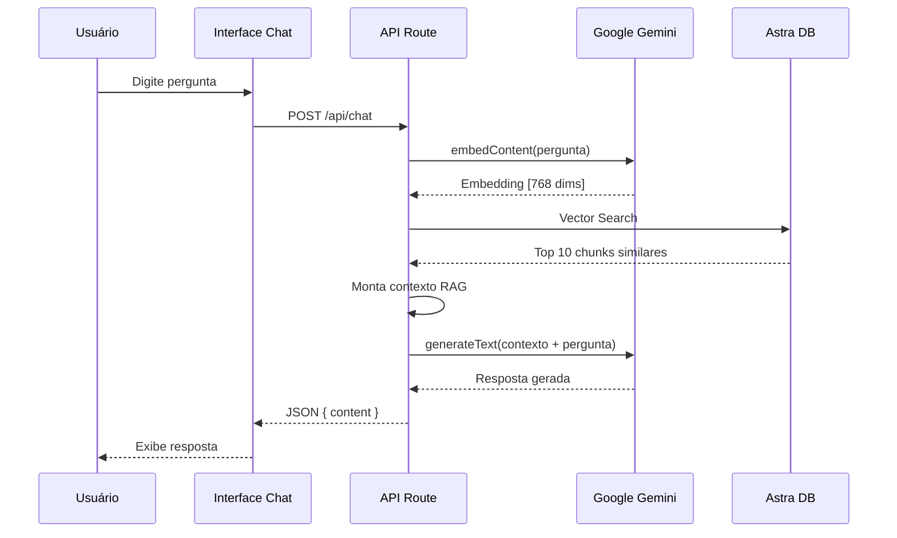

# 🏎️ Chatbot F1 com IA RAG + Next.js

> Chatbot inteligente sobre Fórmula 1 utilizando Retrieval-Augmented Generation (RAG), Google Gemini e Astra DB

**Baseado no tutorial:** [YouTube - Chatbot com RAG](https://www.youtube.com/watch?v=d-VKYF4Zow0)

---

## 📋 Índice

- [Arquitetura](#-arquitetura)
- [Tecnologias](#-tecnologias)
- [Bibliotecas e Dependências](#-bibliotecas-e-dependências)
- [Estrutura do Projeto](#-estrutura-do-projeto)
- [Configuração](#️-configuração)
- [Como Usar](#-como-usar)

---

## 🏗️ Arquitetura

### Diagrama de Fluxo



### Fluxo de Dados Detalhado



### Arquitetura de Componentes

```mermaid
graph LR
    subgraph Frontend
        A[page.tsx<br/>Server Component] --> B[Chat.tsx<br/>Client Component]
        B --> C[PromptSuggestions]
        B --> D[LoadingBubble]
    end

    subgraph Backend
        E[/api/chat/route.ts] --> F[Gemini Embeddings]
        E --> G[Gemini Generation]
        E --> H[Astra DB Client]
    end

    subgraph ETL
        I[loadDb.ts] --> J[Puppeteer Scraper]
        I --> K[Text Splitter]
        I --> L[Embedding Generator]
        I --> M[Astra DB Loader]
    end

    B --> E
    I -.Popula.-> H
```

---

## 🚀 Tecnologias

| Tecnologia         | Uso                            |
| ------------------ | ------------------------------ |
| **Next.js 16**     | Framework React com App Router |
| **React 19**       | Biblioteca UI                  |
| **TypeScript**     | Tipagem estática               |
| **Tailwind CSS 4** | Estilização                    |
| **Google Gemini**  | LLM e Embeddings               |
| **Astra DB**       | Banco vetorial                 |
| **Vercel AI SDK**  | Integração com IA              |

---

## 📦 Bibliotecas e Dependências

### **Dependências de Produção**

#### IA e LLM

| Biblioteca              | Versão   | Motivo                                                                                  |
| ----------------------- | -------- | --------------------------------------------------------------------------------------- |
| `ai`                    | ^5.0.110 | **Core do Vercel AI SDK** - Fornece `generateText` e abstrações para trabalhar com LLMs |
| `@ai-sdk/google`        | ^2.0.45  | **Provedor Google Gemini** - Integração oficial do Gemini com AI SDK                    |
| `@ai-sdk/react`         | ^2.0.113 | **Hooks React** - `useChat` para gerenciar estado de conversação                        |
| `@google/generative-ai` | ^0.24.1  | **SDK Google Gemini** - Usado para gerar embeddings (text-embedding-004)                |
| `zod`                   | ^4.1.13  | **Validação de schemas** - Requerido pelo AI SDK para validação de tipos                |

#### Banco de Dados Vetorial

| Biblioteca              | Versão | Motivo                                                                             |
| ----------------------- | ------ | ---------------------------------------------------------------------------------- |
| `@datastax/astra-db-ts` | ^2.1.2 | **Cliente Astra DB** - API oficial para conectar e fazer queries no banco vetorial |

#### Web Scraping e Processamento

| Biblioteca                 | Versão   | Motivo                                                                                    |
| -------------------------- | -------- | ----------------------------------------------------------------------------------------- |
| `puppeteer`                | ^24.32.1 | **Browser Headless** - Faz scraping de páginas web (Wikipedia, F1.com)                    |
| `@langchain/community`     | ^1.0.7   | **Ferramentas LangChain** - Contém `PuppeteerWebBaseLoader` para scraping estruturado     |
| `@langchain/textsplitters` | ^1.0.1   | **Divisor de Texto** - `RecursiveCharacterTextSplitter` para quebrar documentos em chunks |
| `@langchain/core`          | ^1.1.4   | **Core LangChain** - Dependência interna dos outros pacotes LangChain                     |
| `langchain`                | ^1.1.5   | **Orquestração** - Framework para aplicações com LLMs                                     |

#### Framework e Utilitários

| Biblioteca  | Versão  | Motivo                                                          |
| ----------- | ------- | --------------------------------------------------------------- |
| `next`      | 16.0.8  | **Framework React** - App Router, Server Components, API Routes |
| `react`     | 19.2.1  | **Biblioteca UI**                                               |
| `react-dom` | 19.2.1  | **DOM Renderer**                                                |
| `dotenv`    | ^17.2.3 | **Variáveis de Ambiente** - Carrega `.env` no script de seed    |
| `ts-node`   | ^10.9.2 | **Executor TypeScript** - Roda o script `loadDb.ts` diretamente |

### **Dependências de Desenvolvimento**

| Biblioteca             | Versão | Motivo                          |
| ---------------------- | ------ | ------------------------------- |
| `typescript`           | ^5     | **Tipagem estática**            |
| `@types/node`          | ^20    | **Tipos Node.js**               |
| `@types/react`         | ^19    | **Tipos React**                 |
| `@types/react-dom`     | ^19    | **Tipos React DOM**             |
| `tailwindcss`          | ^4     | **Framework CSS**               |
| `@tailwindcss/postcss` | ^4     | **Plugin PostCSS**              |
| `eslint`               | ^9     | **Linter**                      |
| `eslint-config-next`   | 16.0.8 | **Configuração ESLint Next.js** |

---

## 📂 Estrutura do Projeto

```
chatbotai-nextjsf1/
├── app/
│   ├── api/
│   │   └── chat/
│   │       └── route.ts          # 🔌 Endpoint da API de chat
│   ├── components/
│   │   ├── Chat.tsx               # 💬 Componente principal do chat
│   │   ├── LoadingBubble.tsx      # ⏳ Animação "digitando..."
│   │   └── PromptSuggestionsRow.tsx # 💡 Sugestões de perguntas
│   ├── scripts/
│   │   └── loadDb.ts              # 🛠️ Script ETL para popular o banco
│   ├── globals.css                # 🎨 Estilos globais
│   ├── layout.tsx                 # 📐 Layout raiz
│   └── page.tsx                   # 🏠 Página inicial (Server Component)
├── public/
│   └── f1-logo.svg                # 🏎️ Logo F1
├── .env                           # 🔐 Variáveis de ambiente
├── package.json
└── README.md
```

---

## ⚙️ Configuração

### 1️⃣ Pré-requisitos

- **Node.js** 18+
- **npm** ou **yarn**
- **Conta Google AI Studio** (para Gemini API)
- **Conta DataStax Astra DB**

### 2️⃣ Variáveis de Ambiente

Crie um arquivo `.env` na raiz do projeto:

```env
# Astra DB
ASTRA_DB_NAMESPACE=seu_namespace
ASTRA_DB_COLLECTION=f1_embeddings
ASTRA_DB_API_ENDPOINT=https://sua-database-id-regiao.apps.astra.datastax.com
ASTRA_DB_APPLICATION_TOKEN=AstraCS:xxxxx

# Google Gemini
GOOGLE_AI_GENERATE=sua_chave_api_gemini
```

### 3️⃣ Instalação

```bash
# Instalar dependências
npm install

# Popular o banco de dados (ETL)
npm run seed

# Iniciar servidor de desenvolvimento
npm run dev
```

### 4️⃣ Acesse

Abra [http://localhost:3000](http://localhost:3000) no navegador.

---

## 🎯 Como Usar

### **Chat Interativo**

1. Digite sua pergunta sobre F1 no campo de texto
2. Clique em "Enviar" ou pressione Enter
3. Aguarde a resposta do bot (animação de loading estilo WhatsApp)
4. Veja a resposta gerada com contexto da base de conhecimento

### **Sugestões de Perguntas**

Quando não há mensagens, o chat exibe botões com perguntas sugeridas:

- "Quem ganhou o campeonato de 2024?"
- "Quais são os principais pilotos?"
- "O que é DRS?"

### **Popular Banco de Dados**

```bash
npm run seed
```

**O que faz:**

1. Scraping de páginas (Wikipedia, F1.com)
2. Divide textos em chunks de 512 caracteres
3. Gera embeddings com Gemini
4. Insere no Astra DB

Para adicionar mais URLs, edite `app/scripts/loadDb.ts`:

```typescript
const f1Data = [
  "https://pt.wikipedia.org/wiki/Campeonato_Mundial_de_F%C3%B3rmula_1_de_2025",
  "https://www.formula1.com/...", // Adicione mais aqui
];
```

---

## 🧠 Como Funciona o RAG

### Retrieval-Augmented Generation

1. **Pergunta do Usuário**: "Quem venceu o GP de Mônaco 2024?"
2. **Geração de Embedding**: Converte a pergunta em vetor (768 dimensões)
3. **Busca Vetorial**: Encontra os 10 chunks mais similares no Astra DB
4. **Contexto**: Combina os chunks encontrados em um contexto
5. **Geração**: Gemini usa o contexto + pergunta para gerar resposta precisa

**Vantagem:** O bot responde com informações atualizadas do banco, não apenas do conhecimento pré-treinado do modelo.

---

## 🛠️ Scripts Disponíveis

| Comando         | Descrição                          |
| --------------- | ---------------------------------- |
| `npm run dev`   | Inicia servidor de desenvolvimento |
| `npm run build` | Cria build de produção             |
| `npm run start` | Inicia servidor de produção        |
| `npm run seed`  | Popula banco de dados com scraping |
| `npm run lint`  | Executa linter                     |

---

## 📝 Licença

Este projeto é baseado no tutorial do YouTube e está sob licença MIT.

---

## 🙏 Créditos

- **Tutorial Base**: [YouTube - Chatbot RAG](https://www.youtube.com/watch?v=d-VKYF4Zow0)
- **Google Gemini**: LLM e Embeddings
- **DataStax Astra DB**: Banco vetorial
- **Vercel AI SDK**: Framework de integração

---

## 🐛 Troubleshooting

### Erro: `append is not a function`

- Reinstale pacotes: `npm install --legacy-peer-deps`
- Verifique versões do `@ai-sdk/react`

### Erro: API Key inválida

- Confirme a chave `GOOGLE_AI_GENERATE` no `.env`
- Verifique se a chave tem permissões no Google AI Studio

### Banco vazio

- Execute `npm run seed` para popular
- Aguarde o scraping completar (pode demorar alguns minutos)

---

**Desenvolvido com ❤️ e IA**
